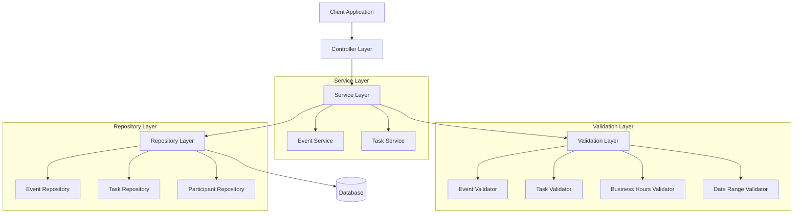
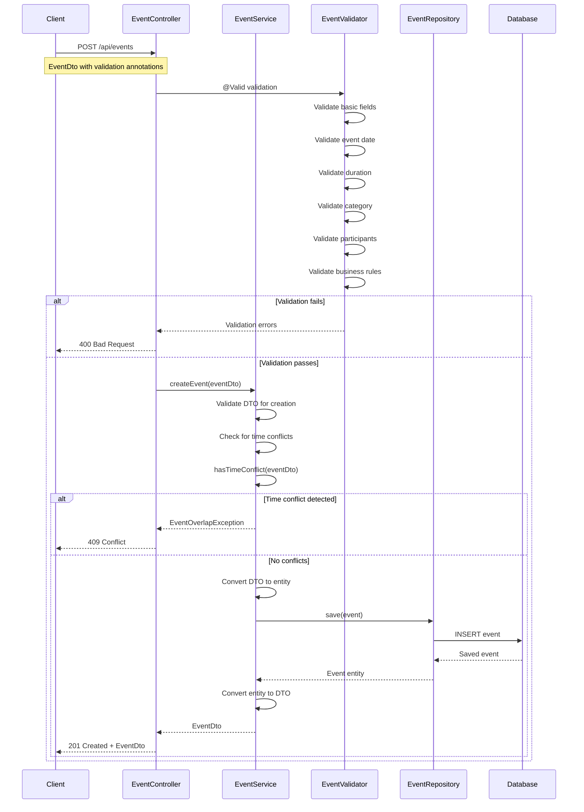
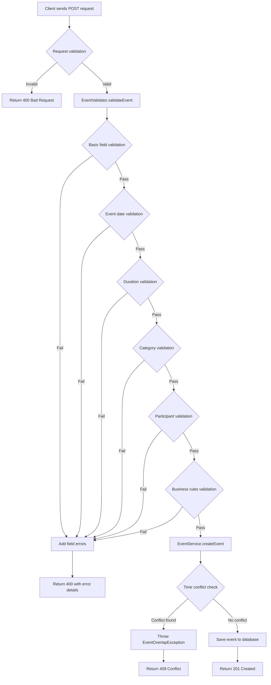
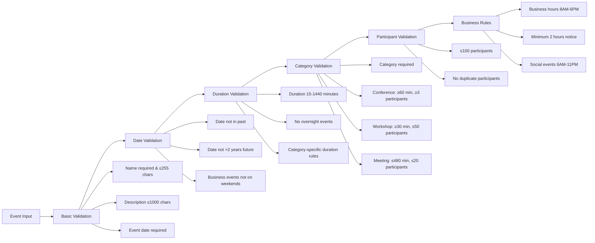
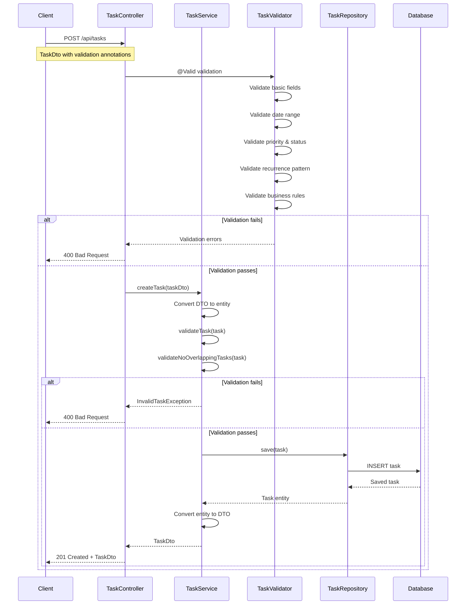
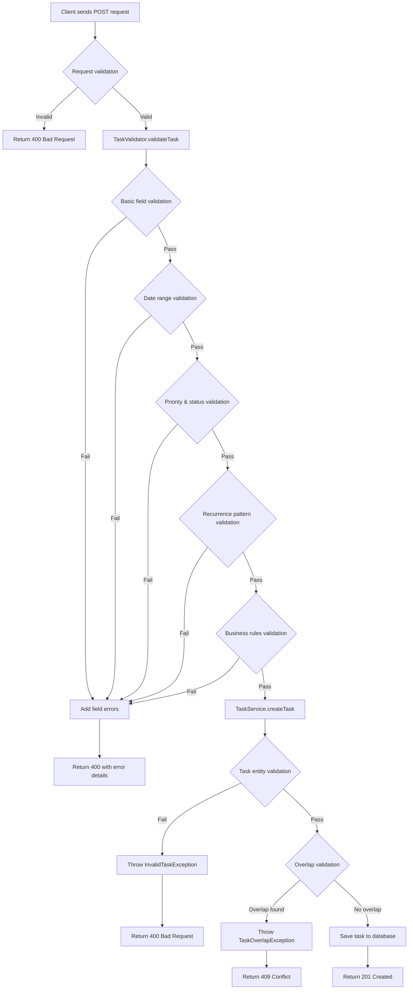
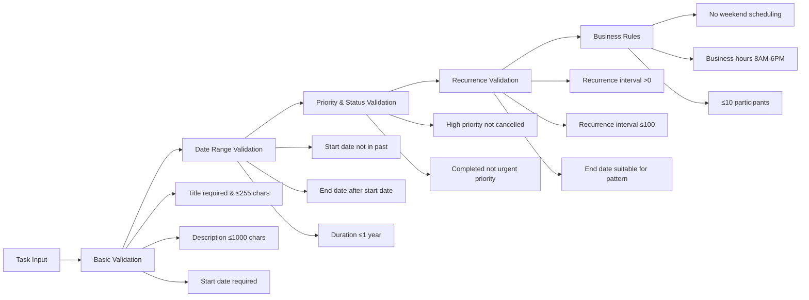
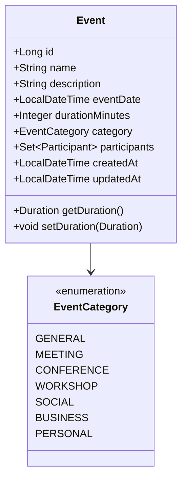
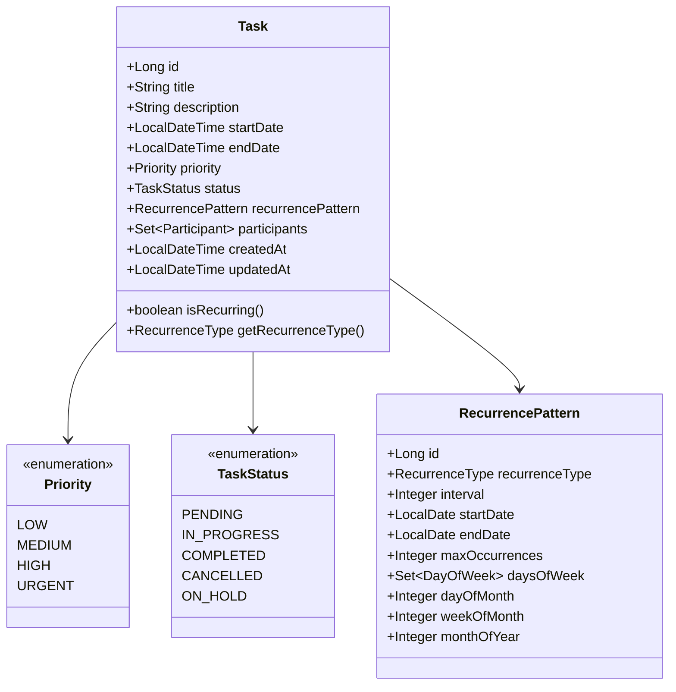
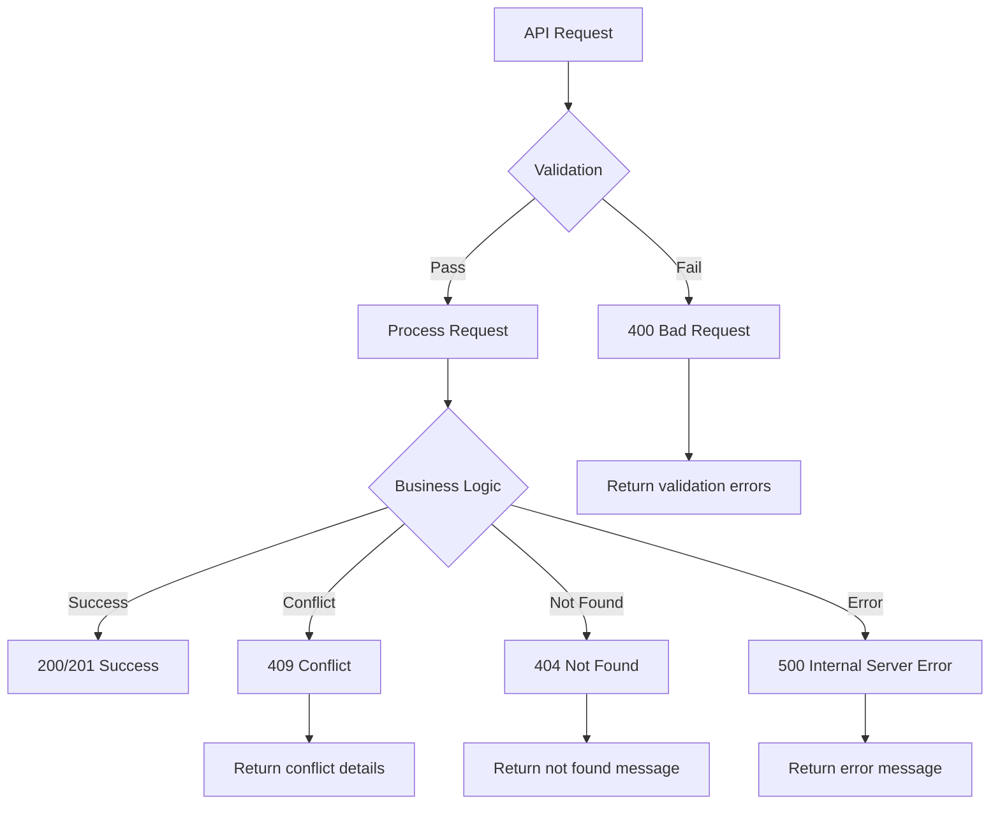

# AI Tools Java Cursor - API Documentation

## Overview

This document provides comprehensive documentation for the AI Tools Java Cursor application, focusing on the Task Management and Event Management APIs. The application is built using Spring Boot with a layered architecture that includes controllers, services, repositories, and validation layers.

## Architecture Overview



## Event Creation Flow

The event creation process involves multiple validation layers and conflict checking to ensure data integrity and prevent scheduling conflicts.

### Event Creation Sequence Diagram



### Event Creation Flow Diagram



### Event Validation Rules



## Task Creation Flow

The task creation process includes validation for business rules, priority/status combinations, and recurrence patterns.

### Task Creation Sequence Diagram



### Task Creation Flow Diagram



### Task Validation Rules



## API Endpoints

### Event Management Endpoints

| Method | Endpoint | Description | Status Codes |
|--------|----------|-------------|--------------|
| POST | `/api/events` | Create new event | 201, 400, 409 |
| PUT | `/api/events/{id}` | Update existing event | 200, 400, 404, 409 |
| DELETE | `/api/events/{id}` | Cancel/delete event | 204, 404 |
| GET | `/api/events/{id}` | Get event by ID | 200, 404 |
| GET | `/api/events` | Get all events (paginated) | 200, 400 |
| GET | `/api/events/search` | Search events | 200, 400 |
| GET | `/api/events/upcoming` | Get upcoming events | 200, 400 |
| GET | `/api/events/calendar/{year}/{month}` | Monthly calendar view | 200, 400 |
| GET | `/api/events/week/{date}` | Weekly calendar view | 200, 400 |
| GET | `/api/events/day/{date}` | Daily calendar view | 200, 400 |
| POST | `/api/events/check-conflicts` | Check for conflicts | 200, 400 |
| GET | `/api/events/time-slot-available` | Check time slot availability | 200, 400 |

### Task Management Endpoints

| Method | Endpoint | Description | Status Codes |
|--------|----------|-------------|--------------|
| POST | `/api/tasks` | Create new task | 201, 400, 409 |
| PUT | `/api/tasks/{id}` | Update existing task | 200, 400, 404, 409 |
| DELETE | `/api/tasks/{id}` | Delete task | 204, 404 |
| GET | `/api/tasks/{id}` | Get task by ID | 200, 404 |
| GET | `/api/tasks` | Get all tasks (paginated) | 200, 400 |
| GET | `/api/tasks/search` | Search tasks by title | 200 |
| GET | `/api/tasks/upcoming` | Get upcoming tasks | 200, 400 |
| GET | `/api/tasks/date-range` | Get tasks in date range | 200, 400 |
| GET | `/api/tasks/status/{status}` | Get tasks by status | 200, 400 |
| GET | `/api/tasks/priority/{priority}` | Get tasks by priority | 200, 400 |
| GET | `/api/tasks/overdue` | Get overdue tasks | 200 |
| PATCH | `/api/tasks/{id}/status/{status}` | Update task status | 200, 404 |
| PATCH | `/api/tasks/{id}/complete` | Mark task as completed | 200, 404 |
| PATCH | `/api/tasks/{id}/start` | Start task | 200, 404 |
| PATCH | `/api/tasks/{id}/cancel` | Cancel task | 200, 404 |
| PATCH | `/api/tasks/{id}/hold` | Put task on hold | 200, 404 |

## Data Models

### Event Model



### Task Model



## Error Handling

### Common Error Responses



### Validation Error Structure

```json
{
  "timestamp": "2024-01-15T10:30:00",
  "status": 400,
  "errors": [
    {
      "field": "eventDate",
      "message": "Event date cannot be in the past",
      "code": "event.date.past"
    },
    {
      "field": "durationMinutes",
      "message": "Event duration must be at least 15 minutes",
      "code": "event.duration.too.short"
    }
  ]
}
```

## Business Rules Summary

### Event Business Rules

1. **Time Constraints**
   - Events cannot be scheduled in the past
   - Events cannot be scheduled more than 2 years in advance
   - Minimum 2 hours notice required
   - No overnight events (spanning multiple days)

2. **Duration Rules**
   - Minimum duration: 15 minutes
   - Maximum duration: 24 hours (1440 minutes)
   - Category-specific duration requirements

3. **Business Hours**
   - Business events: 8 AM - 6 PM
   - Social events: 6 AM - 11 PM
   - No business events on weekends

4. **Participant Limits**
   - Maximum 100 participants per event
   - No duplicate participants
   - Category-specific participant requirements

### Task Business Rules

1. **Time Constraints**
   - Tasks cannot be scheduled in the past
   - Maximum duration: 1 year
   - No weekend scheduling
   - Business hours: 8 AM - 6 PM

2. **Priority & Status Rules**
   - High priority tasks cannot be cancelled
   - Completed tasks cannot have urgent priority
   - Valid status transitions enforced

3. **Recurrence Rules**
   - Recurrence interval: 1-100
   - End date must be suitable for recurrence pattern
   - Maximum 100 recurring instances

4. **Participant Limits**
   - Maximum 10 participants per task

## Testing Strategy

The application includes comprehensive unit tests for all validation classes:

- **BusinessHoursValidatorTest**: Tests business hours validation logic
- **ValidDateRangeValidatorTest**: Tests date range validation
- **EventValidatorTest**: Tests event-specific validation rules
- **TaskValidatorTest**: Tests task-specific validation rules

All tests use JUnit 5 and Mockito for mocking dependencies.

## Security Considerations

1. **Input Validation**: All inputs are validated using Bean Validation annotations and custom validators
2. **SQL Injection Prevention**: Using JPA repositories with parameterized queries
3. **XSS Prevention**: Input sanitization and proper content type headers
4. **Rate Limiting**: Consider implementing rate limiting for API endpoints
5. **Authentication**: Consider adding authentication and authorization layers

## Performance Considerations

1. **Database Indexing**: Ensure proper indexes on frequently queried fields
2. **Pagination**: All list endpoints support pagination
3. **Caching**: Consider implementing caching for frequently accessed data
4. **Connection Pooling**: Configure appropriate database connection pool settings
5. **Async Processing**: Consider async processing for heavy operations like conflict checking

## Monitoring and Logging

1. **Structured Logging**: Using SLF4J with proper log levels
2. **Performance Metrics**: Consider adding metrics for API response times
3. **Error Tracking**: Implement proper error tracking and alerting
4. **Health Checks**: Implement health check endpoints
5. **Audit Trail**: Consider adding audit logging for data changes 